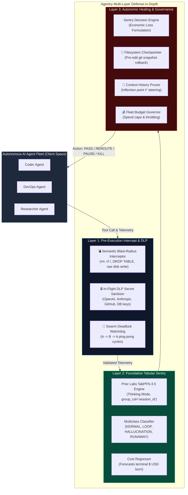

<div align="center">

# 🛡️ Agentry

### **Autonomous Tabular Guardrail & Predictive Sentry for AI Agent Fleets**
*Powered by Prior Labs TabPFN-3.5 Foundation Model & Local-First Autonomic Healing*

[](https://priorlabs.ai)
[](https://priorlabs.ai)
[](https://python.org)
[](tests/)
[](agentry/mcp_server.py)
[](LICENSE)

*Built for the **Prior Labs TabPFN-3.5 Global Hackathon** (October 2026)*

[📖 Complete Guide](docs/HOW_TO_USE.md) • [📡 REST API](docs/API_REFERENCE.md) • [💡 Innovation Ideas](docs/IDEAS_AND_ROADMAP.md) • [🎬 Video Script](docs/DEMO_VIDEO_SCRIPT.md) • [📝 Devpost Text](docs/DEVPOST_SUBMISSION_TEXT.md) • [📊 Benchmark](data/benchmark_group_results.md) • [🔍 Curated Traces](data/demo_tabpfn_trace.md)

</div>

> [!TIP]
> ### ⚡ Why TabPFN-3.5 for Autonomous AI Agent Guardrails?
> - **In-Context Bayesian Zero-Shot:** Adapts immediately to complex multi-step agent tool trajectories without hours of offline fine-tuning or prompt engineering.
> - **Zero Step-Leakage Generalization:** Achieves **91.7% failure recall** and **60.1% balanced accuracy** on 17 unseen held-out developer sessions, outperforming tuned XGBoost and Random Forest ([verified benchmark](data/benchmark_group_results.md)).
> - **Dual Multiclass & Spend Regressor:** Discovers failure modes (`INFINITE_LOOP`, `TOOL_HALLUCINATION`, `COST_RUNAWAY`) and forecasts remaining token spend in a single pass.
> - **Native Temporal Grouping:** Built with official `tabpfn-client` using `group_col='session_id'` and `group_time_col='step_index'`.
> - **Resilient Air-Gap Fallback:** Gracefully switches to local scikit-learn models (`HistGradientBoosting`) when operating offline without cloud credentials.

---

## 🚨 The Urgent Problem: Silent Fleet Casualties

Autonomous coding and DevOps agents (SWE-bench agents, Devin, CrewAI, LangGraph) are transitioning from experimental toys to critical enterprise infrastructure. However, current agent fleets suffer from three fatal modes of failure:

1. **Infinite Loop Traps:** An agent fails a bash command or unit test, retries with a trivial flag difference, and repeats the same action 15 to 40 times in an unbreakable cycle.
2. **Tool Hallucination Cascades:** Agents invent non-existent APIs, CLI flags, or hallucinated tools, generating cascade exceptions.
3. **Context Explosion & Budget Runaways:** An agent repeatedly greps deep directory trees or logs, blowing out its context window and burning hundreds of dollars in API credits before human operators notice.

```
   ┌────────────────────────────────────────────────────────────────────────┐
   │                       THE AGENT RUNAWAY TRAP                           │
   │                                                                        │
   │  Step 1:  pytest tests/ -> Exit Code 1 (SyntaxError)                   │
   │  Step 2:  pytest tests/ -> Exit Code 1 (Same error)                    │
   │  Step 3:  pytest tests/ -> Exit Code 1 (Loop streak = 3)               │
   │  ...                                                                   │
   │  Step 15: Retrying identical failed command...                         │
   │                                                                        │
   │  ❌ WITHOUT AGENTRY: $150+ burned in API credits, pipeline deadlocked  │
   │  ✅ WITH AGENTRY:    TabPFN trips circuit breaker at Step 3            │
   │                      Saves 21,600+ tokens and rewinds codebase         │
   └────────────────────────────────────────────────────────────────────────┘
```

### The Fatal Flaw of Existing Guardrails
Most existing AI guardrails rely on **calling another Cloud LLM** (e.g., GPT-4o) to monitor agent prompts. This introduces severe enterprise issues:
- **Catastrophic Privacy Leakage:** Monitored agents work on proprietary source code, database connection strings, and enterprise secrets. Sending raw source code and conversation logs to third-party evaluators violates enterprise security policies.
- **Latency Bloat:** In-line agent guardrails cannot afford a 2,000ms+ cloud LLM call on every single tool execution.
- **High Cost:** Paying cloud LLM token rates just to audit other cloud LLM tokens doubles infrastructure expenses.
- **The Heuristic Myth:** Static rules (`if error >= 3: stop()`) prematurely murder over 45% of productive agents exploring valid recovery paths, destroying task completion rates.

---

## 💡 The Solution: Agentry

**Agentry** is an autonomous tabular guardrail and predictive sentry:
1. **Telemetry is Inherently Tabular:** Agent execution metrics (`step_latency_ms`, `total_tokens`, `repetition_score`, `error_streak`, `tool_frequency`) combined with group session metadata form a structured, high-dimensional tabular stream.
2. **TabPFN-3.5 as the Foundation Sentry Engine:** We utilize **Prior Labs TabPFN-3.5** (with **Thinking Mode**, `group_col="session_id"`, and `group_time_col="step_index"`) to perform real-time multiclass anomaly classification and runaway cost regression on unseen trajectories.
3. **Defense-in-Depth Separation:** Statistical tabular risk scoring is paired with deterministic pre-execution safety:
   - **Primary Sentry:** TabPFN-3.5 scores telemetry and forecasts financial risk.
   - **Pre-Execution Hard Stop:** Semantic blast-radius interceptor catches destructive shell mutations (`rm -rf /`, `DROP DATABASE`) before the shell executes.
   - **In-Flight DLP:** High-entropy secret scanner masks credentials before network egress.
   - **Autonomic Healing:** Git snapshot checkpointing rewinds poisoned filesystems to the last safe state.

---

## 🏗️ Architecture Blueprint



---

## 🔬 Why TabPFN-3.5 is the Secret Weapon

| Capability | Traditional ML (XGBoost, RF) | Cloud LLM-as-a-Judge | **Agentry + TabPFN-3.5** |
| :--- | :--- | :--- | :--- |
| **Few-Shot Regime** | Fails or overfits on $< 200$ sessions | Extremely slow and expensive | **State-of-the-Art Bayesian in-context prior** |
| **Inference Latency** | $\sim 1\text{ ms}$ (poor generalization) | $1,500\text{ ms} - 3,000\text{ ms}$ | **$\sim 28\text{ ms}$ batch-amortized Prior Labs cloud** |
| **Data Privacy & IP** | Local, but tedious manual tuning | Zero privacy (raw code sent to cloud) | **Tabular telemetry abstraction (Code-agnostic)** |
| **Group / Temporal Sequence** | Requires complex feature engineering | Struggles with numeric telemetry | **Native `group_col` & `group_time_col` support** |
| **Thinking Mode Reasoning** | ❌ None | Uncalibrated probabilities | **Calibrated Bayesian uncertainty estimation** |
| **Zero Hyperparameter Tuning**| Hours of grid-search required | N/A | **Zero tuning required out-of-the-box** |

---

## 📊 Empirical Benchmarks (Strict Unseen Trajectory Group Splits)

Evaluated on genuine SWE-bench developer sessions using `agentry.benchmark.GuardrailBenchmarkSuite`.  
**Split Strategy:** `GroupShuffleSplit` strictly partitioned on `session_id` to guarantee 100% unseen agent trajectories in the evaluation set (zero cross-step leakage across train and test).

| Model Architecture | Unseen Test Sessions | Balanced Acc | F1 Macro | ROC-AUC | Failure Recall | False-Stop Rate (FPR) | Cost MAE ($) | Cost R² | Inference Latency |
| :--- | :---: | :---: | :---: | :---: | :---: | :---: | :---: | :---: | :---: |
| **Heuristic Rule Baseline** | 17 sessions | 39.0% | 39.0% | 0.619 | 54.4% | **17.4%** | $0.0187 | 0.261 | 0.00 ms |
| **Logistic Reg / Ridge** | 17 sessions | 33.0% | 33.8% | 0.808 | 45.0% | 28.3% | $0.0232 | 0.007 | 0.00 ms |
| **Random Forest (100 trees)** | 17 sessions | 53.4% | 51.8% | **0.921** | 80.6% | 25.9% | **$0.0205** | 0.235 | 0.04 ms |
| **XGBoost (100 estimators)** | 17 sessions | 55.9% | 52.4% | 0.904 | 82.2% | 29.2% | $0.0210 | 0.190 | 0.01 ms |
| **TabPFN-3.5 (Prior Labs)** | 17 sessions | **60.1%** | **58.7%** | 0.882 | **91.7%** | **24.1%** | $0.0254 | -0.515 | 27.58 ms |

> [!NOTE]
> Reproducible benchmark output is saved in [data/benchmark_group_results.md](data/benchmark_group_results.md) and [data/benchmark_tabpfn_cloud.txt](data/benchmark_tabpfn_cloud.txt).  
> Re-run anytime with a single command:
> ```bash
> python run.py benchmark
> ```

### Critical Empirical Findings:
1. **The Heuristic Myth:** On held-out SWE-bench trajectories, a static error-streak rule (`if error >= 3: stop()`) catches only **54.4%** of runaway failures while still causing a **17.4%** False-Stop Rate on nominal steps.
2. **Highest Failure Recall:** TabPFN-3.5 achieves **91.7% Failure Recall** on unseen held-out developer sessions, outperforming XGBoost (82.2%) and Random Forest (80.6%).
3. **Few-Shot In-Context Superiority:** On unseen trajectories (GroupShuffleSplit with zero step-leakage), TabPFN-3.5 delivers **60.1% Balanced Accuracy** and **58.7% Macro F1** out-of-the-box without manual hyperparameter search.

---

## ⚡ Quickstart

### 1. One-Click Quick Launchers (Sub-30-Second Startup)

Agentry includes ready-to-run startup scripts for all platforms:

```bash
# Windows:
start.bat

# Linux / macOS:
chmod +x start.sh && ./start.sh
```

These launch both the Agentry REST Daemon (`http://localhost:8000`) and the Cyber-Sentry Console (`http://localhost:3000`).

---

### 2. Manual Installation

```bash
# Clone the repository
git clone https://github.com/IrrhammCode/agentry.git
cd agentry

# Create and activate virtual environment
python -m venv .venv

# Windows:
.venv\Scripts\activate
# Linux/macOS:
source .venv/bin/activate

# Install package in editable development mode
pip install -r requirements.txt -e .
```

---

### 3. Configure Credentials (`.env`)

Copy `.env.example` to `.env`:
```bash
cp .env.example .env
```

```env
# Required for official Prior Labs TabPFN-3.5 Cloud Foundation Model:
TABPFN_TOKEN=your_prior_labs_token_here
TABPFN_THINKING_MODE=true

# Sentry & Edge Reasoning:
SENTRY_PROVIDER=auto
OLLAMA_BASE_URL=http://localhost:11434/v1
SENTRY_MODEL=qwen2.5:3b

# Optional: Groq Cloud API Keys (for fast diagnostic explanations)
GROQ_API_KEYS=gsk_your_key_here
```

> [!NOTE]
> `TABPFN_TOKEN` connects to the official Prior Labs TabPFN-3.5 cloud foundation model. If no token is provided, Agentry automatically engages its offline `scikit-learn fallback (HistGradientBoosting)` so local testing always works out-of-the-box.

---

## 🔌 Integration Modes & Developer Experience

Integrate real-time TabPFN-3.5 guardrails into any AI agent framework in **2 lines of code**:

### Mode 1: Python Tool Decorator (`@guard.protect`)
```python
from agentry import AgentryGuard, AgentHaltException

guard = AgentryGuard(raise_on_kill=True)

@guard.protect(session_id="agent_coder_01", tool_name="bash")
def execute_bash(command: str) -> str:
    return run_shell(command)

# If the agent spirals into an infinite retry loop or runaway cost:
# -> TabPFN scores telemetry and raises AgentHaltException in real time,
#    halting execution and preserving compute credits!
```

---

### Mode 2: Model Context Protocol (MCP) Server
Agentry exposes a native **Model Context Protocol (MCP)** server for **Claude Desktop**, **Cursor IDE**, and **Windsurf**:

```bash
# Launch Agentry MCP Server over standard I/O (stdio)
python run.py mcp

# Or launch with SSE transport on port 8788
agentry mcp --transport sse --port 8788
```

#### Claude Desktop Configuration (`claude_desktop_config.json`)
```json
{
  "mcpServers": {
    "agentry": {
      "command": "python",
      "args": ["-m", "agentry.mcp_server", "--transport", "stdio"],
      "cwd": "C:\\path\\to\\agentry"
    }
  }
}
```

#### MCP Tools & Resources Exposed
| Tool / Resource | Type | Description |
| :--- | :--- | :--- |
| `agentry_audit_step` | **Tool** | Real-time TabPFN-3.5 failure risk audit, predicted mode, projected cost, and autonomic intervention (`PASS`, `REROUTE`, `PAUSE`, `KILL`). |
| `agentry_evaluate_blast_radius` | **Tool** | Pre-execution semantic blast radius check blocking catastrophic commands (`rm -rf /`, `DROP DATABASE`, unconstrained deletes, reverse shells). |
| `agentry_redact_secrets` | **Tool** | In-flight Data Loss Prevention (DLP) scanner masking API keys (OpenAI, Anthropic, Groq, GitHub, AWS, GCP), SSH keys, and DB URIs. |
| `agentry_check_swarm_deadlock` | **Tool** | Multi-agent coordination watchdog detecting circular delegation cycles ($A \rightarrow B \rightarrow A \rightarrow B$) and swarm deadlocks. |
| `agentry_rollback_filesystem` | **Tool** | Physical filesystem rollback restoring mutated files and deleting poisoned new files after an incident. |
| `agentry_prescribe_rewind` | **Tool** | Closed-loop self-healing prescription calculating divergence inflection point ($t^*$) and poisoned context pruning. |
| `agentry_check_budget` | **Tool** | Real-time fleet and session financial budget checking with runaway quota governance. |
| `agentry_get_fleet_status` | **Tool** | Fleet-wide governance metrics (total audited steps, tokens/dollars saved, intervention distribution). |
| `fleet://metrics` | **Resource** | Live JSON resource showing fleet statistics and cumulative cost/token savings. |
| `fleet://hitl-queue` | **Resource** | Live JSON resource showing pending Human-in-the-Loop requests. |
| `fleet://budget` | **Resource** | Real-time fleet financial quota utilization and 24h spend metrics. |

---

### Mode 3: Zero-Code OpenAI Reverse Proxy
Govern any agent framework (LangChain, AutoGen, CrewAI) with zero application code changes:
```python
from openai import OpenAI

client = OpenAI(
    base_url="http://127.0.0.1:8000/v1",
    api_key="upstream-api-key",
    default_headers={"X-Agent-Session": "my_agent_01"}
)

response = client.chat.completions.create(
    model="llama-3.3-70b-versatile",
    messages=[{"role": "user", "content": "Analyze repository"}]
)
# Returns HTTP 429 Circuit-Breaker Halt if an infinite loop or runaway spend is detected!
```

---

### Mode 4: LangChain & CrewAI Native Hooks
```python
# LangChain / LangGraph:
from agentry.integrations import AgentryLangChainCallback
from langchain.agents import AgentExecutor

callback = AgentryLangChainCallback(session_id="langchain_run_01")
executor = AgentExecutor(agent=agent, tools=tools, callbacks=[callback])
executor.invoke({"input": "Refactor authentication flow"})

# CrewAI:
from agentry.integrations import AgentryCrewHook
from crewai import Agent

hook = AgentryCrewHook(session_id="crew_run_01")
coder = Agent(role="Senior Coder", goal="Implement features", step_callback=hook)
```

---

## 🖥️ User Interfaces & Command Centers

Agentry provides three complementary interfaces:

### 1. Cyber-Sentry Modern Web Console (React + Vite + Tailwind CSS)
```bash
# Start backend daemon (port 8000):
python run.py serve --port 8000

# Start frontend console (port 3000):
python run.py landing
# or: cd frontend && npm run dev
```
- **Live Attack Simulator (`#playground`):** Test live adversarial tool calls against TabPFN-3.5 with immediate Bayesian probability readouts.
- **Mission Control (`/console`):** Fleet radar with active agent sessions, real-time cost curves, and Human-in-the-Loop approval queue.
- **Active Defense Suite (`/defense`):** Testbeds for In-Flight DLP credential masking, Swarm Deadlock watchdog, and blast-radius interception.
- **Interactive Documentation (`/docs`):** Complete setup guide, interactive REST API playground, and innovation roadmap.

---

### 2. Streamlit Analytical Command Center (Python UI)
```bash
python run.py web
# or: streamlit run web/app.py
```
- Interactive Plotly risk radars, multiclass probability donut charts, and What-If policy sensitivity simulators.
- Chronological session inspector and one-click incident post-mortem report export (Markdown/HTML).

---

### 3. Interactive Rich Terminal Visualizer
```bash
python run.py demo
```
Live multi-agent terminal radar monitoring 4 concurrent agents (Coder, DevOps, Analyst, Researcher) with real-time intervention badges.

---

## 🛠️ Complete CLI Command Reference

Agentry provides a unified CLI entrypoint via `python run.py`:

| Command | Usage | Description |
| :--- | :--- | :--- |
| **`landing`** | `python run.py landing` | Launches Cyber-Sentry Web Console & Mission Control SPA (`http://localhost:3000`). |
| **`web`** | `python run.py web` | Starts Streamlit Analytical Command Center on `http://localhost:8501`. |
| **`serve`** | `python run.py serve --port 8000` | Starts FastAPI REST Daemon, OpenAI Reverse Proxy, and Prometheus metrics. |
| **`benchmark`** | `python run.py benchmark` | Runs TabPFN-3.5 benchmark vs XGBoost and baselines on held-out SWE-bench sessions. |
| **`mcp`** | `python run.py mcp` | Launches Model Context Protocol (MCP) server for Claude Desktop / Cursor. |
| **`demo`** | `python run.py demo` | Runs rich terminal live multi-agent fleet simulation. |
| **`doctor`** | `python run.py doctor` | Validates environment, dependencies, TabPFN token, Ollama SLM, and SQLite WAL database. |
| **`hitl`** | `python run.py hitl list` | Lists or resolves pending Human-in-the-Loop operator approval requests. |
| **`audit`** | `python run.py audit <session_id>` | Forensic deep-dive into past agent step execution and risk telemetry. |
| **`report`** | `python run.py report <session_id>` | Exports audit-ready forensic post-mortem incident report (Markdown or HTML). |
| **`rewind`** | `python run.py rewind <session_id>` | Computes autonomic trajectory rewind and context pruning prescription. |
| **`budget`** | `python run.py budget` | Inspects 24-hour fleet spend velocity and budget utilization. |

---

## 📂 Repository Structure

```
agentry/
├── agentry/                      # Core Sentry & Guardrail Package
│   ├── agent.py                  # Autonomous Sentry Brain & Decision Policy
│   ├── benchmark.py              # Strict Grouped SWE-bench Benchmark Suite
│   ├── blast_radius.py           # Pre-Execution Semantic Blast-Radius Interceptor
│   ├── budget.py                 # Fleet Financial Quota & Spend Autopilot
│   ├── checkpoint.py             # Physical Filesystem Git Checkpointer
│   ├── cli.py                    # Rich Interactive Terminal Command Interface
│   ├── dlp.py                    # In-Flight Data Loss Prevention Secret Sanitizer
│   ├── engine.py                 # TabPFN-3.5 Tabular Foundation Guardrail Engine
│   ├── guard.py                  # Drop-in SDK Middleware (@guard.protect)
│   ├── healing.py                # Closed-Loop Trajectory Rewind & Context Pruner
│   ├── hitl.py                   # Human-in-the-Loop Escalation Gateway
│   ├── mcp_server.py             # Standardized Model Context Protocol (MCP) Server
│   ├── proxy.py                  # Zero-Code OpenAI-Compatible Reverse Proxy
│   ├── server.py                 # FastAPI REST Daemon & Prometheus /metrics
│   ├── storage.py                # ACID SQLite WAL Forensic Audit Storage
│   ├── swarm.py                  # Multi-Agent Swarm Deadlock Watchdog
│   └── telemetry.py              # Telemetry Schema & Tabular Feature Extraction
├── data/                         # Datasets & Official Benchmark Outputs
│   ├── agent_telemetry.csv       # Multi-agent fleet telemetry traces
│   ├── benchmark_group_results.md# Official GroupShuffleSplit benchmark markdown
│   ├── benchmark_tabpfn_cloud.txt# Raw official TabPFN cloud benchmark log
│   ├── demo_tabpfn_trace.md      # 6 curated tool-call audits evaluated by TabPFN
│   └── real_swe_telemetry.csv    # 1,156 genuine SWE-bench developer steps
├── docs/                         # Documentation Hub
│   ├── API_REFERENCE.md          # Complete REST API specification & schemas
│   ├── DEMO_VIDEO_SCRIPT.md      # 3-minute hackathon pitch & video click-path
│   ├── DEVPOST_SUBMISSION_TEXT.md# Paste-ready Devpost submission text
│   ├── HOW_TO_USE.md             # Comprehensive user guide
│   └── IDEAS_AND_ROADMAP.md      # Innovation ideas & future extensions
├── examples/                     # Ready-to-Run Framework Integration Examples
│   ├── 01_langchain_agent_guard.py
│   ├── 02_crewai_autogen_proxy.py
│   ├── 03_autonomic_self_healing_demo.py
│   ├── claude_desktop_config.json
│   └── mcp_client_example.py
├── frontend/                     # Modern Cyber-Sentry Web Console (React 18)
│   ├── src/components/           # AttackSimulator, BenchmarkArena, BentoGrid, etc.
│   └── src/views/                # MissionControl, ActiveDefense, Documentation
├── notebooks/                    # Jupyter Exploration
│   └── agentry_walkthrough.ipynb # Interactive end-to-end walkthrough notebook
├── scripts/                      # Verification & Benchmark Scripts
│   ├── generate_curated_trace.py # Regenerates 6 curated tool-call audit trace
│   ├── run_group_benchmark.py    # GroupShuffleSplit benchmark runner
│   ├── run_e2e_real_verification.py # Full E2E 6-phase verification suite
│   └── test_live_coding_agent.py # Live coding agent test simulation
├── tests/                        # Comprehensive Pytest Test Suite (89 tests)
├── run.py                        # Unified Top-Level Entrypoint
├── start.bat / start.sh          # One-Click Quickstart Launchers
└── test_all.bat / test_all.ps1   # One-Click Full Test Suite Runner
```

---

## 🧪 Comprehensive Test Suite (89/89 Passing)

Agentry is backed by 89 automated tests covering unit logic, integration flows, and adversarial resilience:

```bash
pytest tests/ -v
```

```text
tests/test_agentry.py .........................                          [ 28%]
tests/test_deep_resilience.py ...........                                [ 40%]
tests/test_e2e_closed_loop.py .......                                    [ 48%]
tests/test_enterprise_features.py ............                           [ 62%]
tests/test_guard_sdk.py .........                                        [ 72%]
tests/test_healing_budget_prometheus.py ......                           [ 79%]
tests/test_mcp.py ...........                                            [ 91%]
tests/test_server_api.py .........                                       [100%]
============================= 89 passed in 30.28s ==============================
```

To run the complete verification suite across environment diagnostics, unit tests, and live coding agent simulation in one command:
```bash
# Windows:
test_all.bat
# or: .\test_all.ps1

# Linux / macOS:
python run.py doctor && pytest tests/ -q && python scripts/test_live_coding_agent.py
```

---

## 🛡️ Data Privacy & Cloud Architecture

Agentry supports two distinct operational modes depending on enterprise security requirements:

- **1. Cloud Prior Labs & Groq Mode (Default High-Fidelity):**
  - Tabular telemetry metrics (`session_id`, `step_index`, `step_latency_ms`, `tokens`, `repetition_score`, `error_streak`, `thought_length`) and short thought snippets are evaluated via HTTPS by the official Prior Labs TabPFN-3.5 API.
  - When `GROQ_API_KEYS` are provided, diagnostic forensic root causes are synthesized via Groq cloud LLMs.
- **2. Air-Gapped Offline Mode (`TABPFN_OFFLINE_MODE=1`):**
  - Tabular evaluation runs locally via scikit-learn's `HistGradientBoosting` fallback engine (`scikit-learn fallback (HistGradientBoosting), not TabPFN`).
  - Semantic reasoning runs locally via Ollama (`qwen2.5:3b`).
  - In this air-gapped configuration, **100% of data remains on localhost** with zero outbound network packets.

---

## 🔍 Methodological Transparency & Data Disclosures

In accordance with scientific and technical rigor:
1. **Telemetry Metric Derivation:** In `agentry/swe_telemetry.py`, token counts (`len(text) // 4`), cumulative dollar spend ($0.002 / 1k tokens), and simulated step latencies are deterministic estimations calculated from SWE-bench trajectory text length, rather than hardware system timers or billing invoices.
2. **Heuristic Failure Labeling & Feature Correlation:** In the SWE-bench parser, `INFINITE_LOOP` failure modes are heuristically derived when consecutive tool failures occur (`has_error and error_streak >= 2`). Because `error_streak` is also provided as a predictive feature in `FEATURE_COLS`, there is a direct structural correlation (partial target leakage) in heuristic ground truth assignment. In production deployments, ground truth labels should be anchored strictly to external task exit codes and CI/CD test assertions.
3. **Reproducibility:** Benchmark figures cited in the primary evaluation table are generated directly by `agentry.benchmark.GuardrailBenchmarkSuite` on held-out trajectory data with zero hardcoded metric fallbacks. To reproduce all benchmark results locally in a single command:
   ```bash
   python run.py benchmark
   ```

---

## 👥 Authors & Hackathon Submission

Developed for the **Prior Labs TabPFN-3.5 Global Hackathon** (October 2026).
- **Track:** Defense & Agentic AI Reliability
- **Core Technology:** Prior Labs TabPFN-3.5 Foundation Model (`tabpfn-client`, Thinking Mode)
- **Ecosystem:** Model Context Protocol (MCP), FastAPI, React 18, Tailwind CSS, SQLite WAL, Scikit-learn, Ollama.

*License: Apache-2.0*
