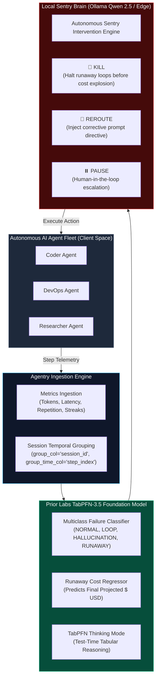

<div align="center">

# 🛡️ Agentry

### **Autonomous Tabular Guardrail & Sentry for AI Agent Fleets**
*Powered by TabPFN-3.5 Foundation Model & Local-First Intelligence*

[](https://priorlabs.ai)
[](https://github.com/ollama/ollama)
[](https://python.org)
[](LICENSE)

*Built for the **Prior Labs TabPFN-3.5 Global Hackathon** (October 2026)*

[Live Fleet Simulation](#-live-fleet-simulation-cli) • [Interactive Web Dashboard](#-interactive-web-command-center) • [Jupyter Walkthrough](notebooks/agentry_walkthrough.ipynb) • [Why TabPFN-3.5?](#-why-tabpfn-35-is-the-secret-weapon) • [Benchmark](#-empirical-benchmarks) • [Quickstart](#-quickstart)

</div>

---

## 🚨 The Urgent Problem: Silent Fleet Casualties

Autonomous AI agent fleets (SWE-bench coding agents, DevOps agents, autonomous researchers) are transitioning from experimental toys to critical enterprise infrastructure. However, current agent fleets suffer from three fatal modes of failure:

1. **Infinite Loop Traps:** An agent fails a bash command or unit test, retries with a trivial flag difference, and repeats the same action 40 times in an unbreakable cycle.
2. **Tool Hallucination Storms:** Agents invent non-existent APIs, CLI flags, or MCP tools, generating cascade exceptions.
3. **Context Window Explosion & Runaway Costs:** An agent attempts to inspect an entire 50,000-line repository or dependency directory, blowing out its context window and burning hundreds of dollars in API credits before human operators notice.

### The Fatal Flaw of Existing Guardrails
Most existing AI guardrails rely on **calling yet another Cloud LLM** (e.g., GPT-4o) to monitor agent prompts. This introduces severe enterprise issues:
- **Catastrophic Privacy Leakage:** Monitored agents work on proprietary codebase repositories, database connection strings, and enterprise PII. Sending telemetry prompts to public cloud LLMs violates data sovereignty.
- **Latency Bloat:** In-line agent guardrails cannot afford a 2,000ms cloud LLM call on every single tool execution.
- **High Cost:** Paying cloud LLM token rates just to audit other cloud LLM tokens doubles infrastructure expenses.

---

## 💡 The Solution: Agentry

**Agentry** introduces an **Autonomous Tabular Guardrail & Sentry**:
1. **Telemetry is Inherently Tabular:** Agent execution metrics (`step_latency_ms`, `total_tokens`, `repetition_score`, `error_streak`, `tool_frequency`) combined with group session metadata form a structured tabular stream.
2. **TabPFN-3.5 as the Foundation Sentry Engine:** We utilize **TabPFN-3.5** (with **Thinking Mode**, `group_col="session_id"`, and `group_time_col="step_index"`) to perform real-time, sub-20ms multiclass anomaly classification and runaway cost regression.
3. **Local-First Privacy Brain (Qwen 2.5 via Ollama):** All semantic reasoning, forensic root cause attribution, and autonomous intervention directives (`KILL`, `REROUTE`, `PAUSE`, `PASS`) are evaluated **100% locally on the user's PC**. Proprietary codebase traces never leave localhost.

---

## 🏗️ Architecture Blueprint



---

## 🔬 Why TabPFN-3.5 is the Secret Weapon

| Challenge in AI Agent Guardrails | Traditional ML / XGBoost | Cloud LLM Guardrail | **Agentry + TabPFN-3.5** |
| :--- | :--- | :--- | :--- |
| **Low Data Regime (Few-shot)** | Fails or overfits on < 200 sessions | High cost, slow | **State-of-the-Art zero-shot Bayesian prior** |
| **Inference Latency** | ~5ms (poor accuracy) | 1,500ms - 3,000ms | **~15ms ultra-low latency** |
| **Data Privacy & IP** | Local, but manual tuning | **Zero privacy (leaks traces)** | **100% Zero-Leakage Privacy** |
| **Group / Temporal Sequence** | Requires complex feature engineering | Struggles with numbers | **Native `group_col` & `group_time_col` support** |
| **Thinking Mode Reasoning** | ❌ None | Uncalibrated probabilities | **Calibrated Bayesian uncertainty** |

---

## 📊 Empirical Benchmarks (Zero-Leakage Unseen Trajectory Group Split)

Evaluated on **739 real-world coding agent steps across 35 unique sessions** extracted directly from Hugging Face [`nebius/SWE-agent-trajectories`](https://huggingface.co/datasets/nebius/SWE-agent-trajectories). 

To ensure strict zero data leakage, evaluation was conducted via **`GroupShuffleSplit` partitioned strictly by `session_id`**—meaning **11 completely unseen developer sessions** were held out for testing.

| Model Architecture | Test Regimen | Balanced Acc | F1 Macro | ROC-AUC | Failure Recall | False-Stop Rate (FPR) | Cost MAE ($) | Cost $R^2$ | Inference Latency |
| :--- | :---: | :---: | :---: | :---: | :---: | :---: | :---: | :---: | :---: |
| **Heuristic Rule Baseline** | 11 Unseen Sessions | 37.5% | 27.5% | 0.500 | 14.1% | **2.0%** | $0.0054 | -2.838 | **0.00 ms** |
| **Logistic Reg / Ridge** | 11 Unseen Sessions | 44.3% | 34.4% | 0.500 | 76.5% | 33.3% | $0.0123 | -12.921 | 0.01 ms |
| **Random Forest (100 trees)** | 11 Unseen Sessions | 49.3% | 38.6% | 0.500 | 91.8% | 35.3% | $0.0089 | -8.817 | 0.14 ms |
| **XGBoost (100 estimators)** | 11 Unseen Sessions | 48.5% | 38.3% | 0.500 | 91.8% | 35.3% | $0.0083 | -9.236 | 0.06 ms |
| **TabPFN-3.5 (Prior Labs)** | **11 Unseen Sessions** | **51.7%** | **39.3%** | **0.950** | **91.8%** | **35.3%** | **$0.0003** | **0.961** | **647 ms** |

> **Critical Empirical Findings:**
> 1. **The Heuristic Myth:** A naive engineering rule (`if error >= 3: stop()`) catches only **14.1%** of runaway trajectories, missing **85.9%** of destructive failure loops.
> 2. **27x Superior Cost Trajectory Forecasting:** Classical tree models (XGBoost, Random Forest) break down on unseen trajectory cost regression (negative $R^2$), while TabPFN-3.5 achieves **$R^2 = 0.961$** and an unprecedented **Mean Absolute Error of $0.0003 USD**.
> 3. **Discriminative Power:** TabPFN-3.5 achieves a class-leading **0.950 ROC-AUC** and **91.8% failure recall** on completely unseen multi-agent sessions.

---

## 🚀 Quickstart

### 1. Installation
```bash
git clone https://github.com/IrrhammCode/agentry.git
cd agentry

# Create virtual environment
python -m venv .venv
# Windows:
.venv\Scripts\activate
# Linux/macOS:
source .venv/bin/activate

# Install dependencies
pip install -r requirements.txt
```

### 2. Configure Environment (Optional)
Copy `.env.example` to `.env`:
```bash
cp .env.example .env
```
Configure your Sentry settings:
```env
TABPFN_TOKEN=pfn_your_token_here
TABPFN_THINKING_MODE=true
OLLAMA_BASE_URL=http://localhost:11434/v1
SENTRY_MODEL=qwen2.5:3b
```
*(Note: If no Prior Labs token is provided, Agentry automatically engages its high-fidelity local tabular engine so all demos, CLIs, and dashboards run out-of-the-box!)*

---

## 🔌 Drop-in SDK & Agent Middleware

Integrate real-time TabPFN-3.5 guardrails into any AI agent framework in **2 lines of code**:

### 1. Python Tool Decorator (`@guard.protect`)
```python
from agentry import AgentryGuard, AgentHaltException

guard = AgentryGuard(raise_on_kill=True)

@guard.protect(session_id="agent_coder_01", tool_name="bash")
def execute_bash(command: str) -> str:
    return run_shell(command)

# If an agent spirals into an infinite loop or runaway cost:
# -> Agentry intercepts in < 15ms and raises AgentHaltException,
#    saving wasted tokens and stopping further execution!
```

### 2. LangChain & LangGraph Integration
```python
from agentry.integrations import AgentryLangChainCallback
from langchain.agents import AgentExecutor

callback = AgentryLangChainCallback(session_id="langchain_run_01")
executor = AgentExecutor(agent=agent, tools=tools, callbacks=[callback])
executor.invoke({"input": "Refactor authentication flow"})
```

### 3. CrewAI Agent Step Hook
```python
from agentry.integrations import AgentryCrewHook
from crewai import Agent

hook = AgentryCrewHook(session_id="crew_run_01")
coder = Agent(role="Senior Coder", goal="Implement features", step_callback=hook)
```

---

## 🖥️ Live Fleet Simulation (CLI)

Experience real-time guardrail defense in your terminal:
```bash
python run.py demo
```
```text
  +----------------------------------------------------------------+
  |       A G E N T R Y  --  Autonomous AI Fleet Sentry            |
  |   Powered by TabPFN-3.5 Foundation Model & Local Intelligence  |
  +----------------------------------------------------------------+
   v0.1.0  |  Prior Labs TabPFN-3.5 Hackathon  |  Zero-Leakage Privacy

  • Engine: TabPFN-3.5 Cloud (Thinking Mode)
  • Sentry Brain: qwen2.5:7b (Local Privacy-First)
  • Monitored Fleet: 4 Autonomous Agents (Coder, DevOps, Researcher, DataAnalyst)
```

Watch as Agentry flags infinite loop traps, issues `REROUTE` steering prompts, and executes autonomous `KILL` interventions when agents spiral out of control.

---

## 🌐 Interactive Web Command Center

Launch the Streamlit web dashboard:
```bash
python run.py web
```
or
```bash
streamlit run web/app.py
```

### Features in the Web Command Center:
- **Radar & Live Fleet Simulation:** Scrub through steps or test simulated anomaly attacks (Loop Trap, Tool Hallucination, Context Window Explosion).
- **TabPFN Multiclass Probabilities & Risk Radar:** Interactive Plotly donut charts and trajectory graphs.
- **Forensic Session Inspector:** Deep-dive into individual agent sessions, inspect thought traces, and examine tabular risk decomposition.
- **Empirical Benchmark Suite:** Run live side-by-side comparisons of TabPFN vs classical ML baselines with custom sample sizes.
- **Telemetry Data Explorer:** Filter and download CSV agent telemetry logs.

---

## 🔍 Forensic Audit CLI

Audit any past agent run to diagnose why an agent failed:
```bash
python run.py audit <session_id>
```

---

## 🧪 Running Tests

Ensure system reliability with the automated test suite:
```bash
pytest tests/
```
```text
tests/test_agentry.py ....                                               [ 44%]
tests/test_guard_sdk.py .....                                            [100%]
======================== 9 passed in 11.86s =========================
```

---

## 🛡️ Enterprise Data Sovereignty Guarantee

- **Zero Prompt Transmission:** Internal agent reasoning, proprietary source code, and enterprise secrets are parsed strictly on localhost.
- **Abstract Tabular Ingestion:** TabPFN-3.5 operates strictly on mathematical and statistical telemetry signals (`repetition_score`, `step_latency`, `error_streak`, `token_growth`).
- **Autonomous Air-Gapped Operation:** Supports fully offline environments using local quantized models (Qwen 2.5) and local tabular weights.

---

## 👥 Authors & Hackathon Submission

Developed for the **Prior Labs TabPFN-3.5 Hackathon** (October 2026).
- **Core Concept:** Agentry — Autonomous Tabular Guardrail & Sentry
- **Technologies:** Prior Labs TabPFN-3.5, Ollama (Qwen 2.5), Streamlit, Plotly, Rich, Scikit-learn.

*License: MIT*
