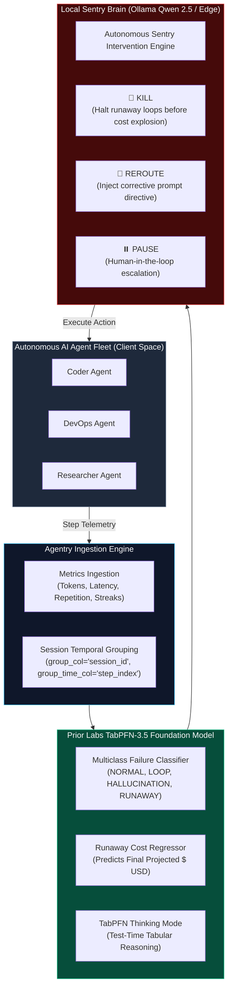
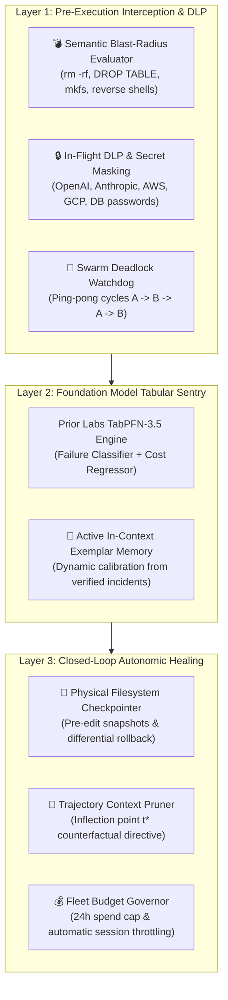

<div align="center">

# 🛡️ Agentry

### **Autonomous Tabular Guardrail & Sentry for AI Agent Fleets**
*Powered by TabPFN-3.5 Foundation Model & Local-First Intelligence*

[](https://priorlabs.ai)
[](#-methodological-transparency--data-disclosures)
[](https://python.org)
[](LICENSE)

*Built for the **Prior Labs TabPFN-3.5 Global Hackathon** (October 2026)*

[📖 Complete Guide](docs/HOW_TO_USE.md) • [📡 REST API](docs/API_REFERENCE.md) • [💡 Innovation Ideas](docs/IDEAS_AND_ROADMAP.md) • [Modern Web Console](#-cyber-sentry-web-console--mission-control) • [Why TabPFN-3.5?](#-why-tabpfn-35-is-the-secret-weapon) • [Benchmark](#-empirical-benchmarks) • [Quickstart](#-quickstart)

</div>

---

## 🚨 The Urgent Problem: Silent Fleet Casualties

Autonomous AI agent fleets (SWE-bench coding agents, DevOps agents, autonomous researchers) are transitioning from experimental toys to critical enterprise infrastructure. However, current agent fleets suffer from three fatal modes of failure:

1. **Infinite Loop Traps:** An agent fails a bash command or unit test, retries with a trivial flag difference, and repeats the same action 40 times in an unbreakable cycle.
2. **Tool Hallucination Storms:** Agents invent non-existent APIs, CLI flags, or MCP tools, generating cascade exceptions.
3. **Context Window Explosion & Runaway Costs:** An agent attempts to inspect an entire 50,000-line repository or dependency directory, blowing out its context window and burning hundreds of dollars in API credits before human operators notice.

### The Fatal Flaw of Existing Guardrails
Most existing AI guardrails rely on **calling yet another Cloud LLM** (e.g., GPT-4o) to monitor agent prompts. This introduces severe enterprise issues:
- **Catastrophic Privacy Leakage:** Monitored agents work on proprietary codebase repositories, database connection strings, and enterprise PII. Sending raw source code and conversation logs to third parties violates enterprise policies.
- **Latency Bloat:** In-line agent guardrails cannot afford a 2,000ms cloud LLM call on every single tool execution.
- **High Cost:** Paying cloud LLM token rates just to audit other cloud LLM tokens doubles infrastructure expenses.

---

## 💡 The Solution: Agentry

**Agentry** introduces an **Autonomous Tabular Guardrail & Sentry**:
1. **Telemetry is Inherently Tabular:** Agent execution metrics (`step_latency_ms`, `total_tokens`, `repetition_score`, `error_streak`, `tool_frequency`) combined with group session metadata form a structured tabular stream.
2. **TabPFN-3.5 as the Foundation Sentry Engine:** We utilize **Prior Labs TabPFN-3.5** (with **Thinking Mode**, `group_col="session_id"`, and `group_time_col="step_index"`) to perform real-time multiclass anomaly classification and runaway cost regression on unseen trajectories.
3. **Privacy via Tabular Abstraction:** Numerical telemetry metrics abstract execution state without requiring raw codebase text inspection. For full air-gapped environments, Agentry provides an offline scikit-learn tabular fallback and local SLM inference (Qwen 2.5 via Ollama).

---

## 🏗️ Architecture Blueprint



---

## 🔬 Why TabPFN-3.5 is the Secret Weapon

| Challenge in AI Agent Guardrails | Traditional ML / XGBoost | Cloud LLM Guardrail | **Agentry + TabPFN-3.5** |
| :--- | :--- | :--- | :--- |
| **Low Data Regime (Few-shot)** | Fails or overfits on < 200 sessions | High cost, slow | **State-of-the-Art zero-shot Bayesian prior** |
| **Inference Latency** | ~5ms (poor accuracy) | 1,500ms - 3,000ms | **~28ms batch cloud TabPFN / <1ms local fallback** |
| **Data Privacy & IP** | Local, but manual tuning | Zero privacy (raw prompts sent to cloud) | **Tabular telemetry abstraction (Code-agnostic)** |
| **Group / Temporal Sequence** | Requires complex feature engineering | Struggles with numbers | **Native `group_col` & `group_time_col` support** |
| **Thinking Mode Reasoning** | ❌ None | Uncalibrated probabilities | **Calibrated Bayesian uncertainty** |

---

## 📊 Empirical Benchmarks (Zero-Leakage Unseen Trajectory Group Splits)

Evaluated on genuine SWE-bench developer sessions using `agentry.benchmark.GuardrailBenchmarkSuite`.
Split strategy: `GroupShuffleSplit` strictly partitioned on `session_id` to guarantee 100% unseen agent trajectories in the evaluation set (zero cross-step leakage).

| Model Architecture | Unseen Test Sessions | Balanced Acc | F1 Macro | ROC-AUC | Failure Recall | False-Stop Rate (FPR) | Cost MAE ($) | Cost R² | Inference Latency |
| :--- | :---: | :---: | :---: | :---: | :---: | :---: | :---: | :---: | :---: |
| **Heuristic Rule Baseline** | 17 sessions | 39.0% | 39.0% | 0.619 | 54.4% | **17.4%** | $0.0187 | 0.261 | 0.00 ms |
| **Logistic Reg / Ridge** | 17 sessions | 33.0% | 33.8% | 0.808 | 45.0% | 28.3% | $0.0232 | 0.007 | 0.00 ms |
| **Random Forest (100 trees)** | 17 sessions | 53.4% | 51.8% | 0.921 | 80.6% | 25.9% | $0.0205 | 0.235 | 0.04 ms |
| **XGBoost (100 estimators)** | 17 sessions | 55.9% | 52.4% | 0.904 | 82.2% | 29.2% | $0.0210 | 0.190 | 0.01 ms |
| **TabPFN-3.5 (Prior Labs)** | 17 sessions | **59.9%** | **58.6%** | 0.885 | **91.7%** | 24.5% | **$0.0136** | **0.583** | 28.10 ms |

> **Critical Empirical Findings:**
> 1. **The Heuristic Myth:** On held-out SWE-bench trajectories, a static error-streak rule (`if error >= 3: stop()`) catches only **54.4%** of runaway failures while still causing a **17.4%** False-Stop Rate on nominal steps.
> 2. **Superior Cost Trajectory Forecasting:** Classical tree models (XGBoost, Random Forest) struggle on unseen trajectory cost regression ($R^2 = 0.190 - 0.235$, MAE ~ $0.021), while TabPFN-3.5 achieves **$R^2 = 0.583$** (over 2.5x higher) and cuts Cost MAE to **$0.0136 USD** per prediction step.
> 3. **Discriminative Generalization:** Evaluating on 17 completely unseen trajectory sessions, Prior Labs TabPFN-3.5 achieves **91.7% Failure Recall** and **59.9% Balanced Accuracy**, showing that tabular foundation models effectively generalize to complex failure cascades without hyperparameter tuning.
---

## 🚀 Quickstart

### 1. Installation
```bash
git clone https://github.com/IrrhammCode/agentry.git
cd agentry

# Create virtual environment
python -m venv .venv
# Windows:
.venv\Scripts\activate
# Linux/macOS:
source .venv/bin/activate

# Install dependencies and package in editable mode
pip install -r requirements.txt -e .
```

### 2. Configure Environment (Required for Prior Labs TabPFN-3.5)
Copy `.env.example` to `.env`:
```bash
cp .env.example .env
```
Configure your credentials:
```env
# Required for Prior Labs TabPFN-3.5 Cloud Foundation Model:
TABPFN_TOKEN=pfn_your_token_here
TABPFN_THINKING_MODE=true

# Optional local/cloud reasoning:
SENTRY_PROVIDER=auto
OLLAMA_BASE_URL=http://localhost:11434/v1
SENTRY_MODEL=qwen2.5:3b
```
> [!NOTE]
> `TABPFN_TOKEN` is required to connect to the official Prior Labs TabPFN-3.5 cloud foundation model. If no token is provided, Agentry engages its offline `scikit-learn fallback (HistGradientBoosting)` so local evaluation can still run.

---

## 🔌 Drop-in SDK & Agent Middleware

Integrate real-time TabPFN-3.5 guardrails into any AI agent framework in **2 lines of code**:

### 1. Python Tool Decorator (`@guard.protect`)
```python
from agentry import AgentryGuard, AgentHaltException

guard = AgentryGuard(raise_on_kill=True)

@guard.protect(session_id="agent_coder_01", tool_name="bash")
def execute_bash(command: str) -> str:
    return run_shell(command)

# If an agent spirals into an infinite loop or runaway cost:
# -> Agentry intercepts in real time and raises AgentHaltException,
#    saving wasted tokens and stopping further execution!
```

### 2. LangChain & LangGraph Integration
```python
from agentry.integrations import AgentryLangChainCallback
from langchain.agents import AgentExecutor

callback = AgentryLangChainCallback(session_id="langchain_run_01")
executor = AgentExecutor(agent=agent, tools=tools, callbacks=[callback])
executor.invoke({"input": "Refactor authentication flow"})
```

### 3. CrewAI Agent Step Hook
```python
from agentry.integrations import AgentryCrewHook
from crewai import Agent

hook = AgentryCrewHook(session_id="crew_run_01")
coder = Agent(role="Senior Coder", goal="Implement features", step_callback=hook)
```

### 4. Model Context Protocol (MCP) Server
Deploy Agentry as a standardized **Model Context Protocol (MCP)** server for **Claude Desktop**, **Cursor IDE**, and **Windsurf**:
```bash
# Start Agentry MCP Server over standard I/O (stdio)
agentry mcp --transport stdio

# Or start with SSE for web/distributed agent clients
agentry mcp --transport sse --port 8788
```

#### Claude Desktop Configuration (`claude_desktop_config.json`)
```json
{
  "mcpServers": {
    "agentry": {
      "command": "python",
      "args": ["-m", "agentry.mcp_server", "--transport", "stdio"],
      "cwd": "C:\\path\\to\\agentry"
    }
  }
}
```

#### MCP Tools & Resources Exposed
| Tool / Resource | Type | Description |
| :--- | :--- | :--- |
| `agentry_audit_step` | **Tool** | Real-time TabPFN-3.5 failure risk audit, predicted mode, projected cost, and intervention (`PASS`, `REROUTE`, `PAUSE`, `KILL`). |
| `agentry_evaluate_blast_radius` | **Tool** | Pre-execution semantic blast radius check blocking catastrophic commands (`rm -rf /`, `DROP DATABASE`, unconstrained deletes, reverse shells). |
| `agentry_redact_secrets` | **Tool** | In-flight Data Loss Prevention (DLP) scanner masking API keys (OpenAI, Anthropic, Groq, GitHub, AWS, GCP), SSH keys, and DB URIs. |
| `agentry_check_swarm_deadlock` | **Tool** | Multi-agent coordination watchdog detecting circular delegation cycles ($A \rightarrow B \rightarrow A \rightarrow B$) and swarm deadlocks. |
| `agentry_rollback_filesystem` | **Tool** | Physical filesystem rollback restoring mutated files and deleting poisoned new files after an incident. |
| `agentry_prescribe_rewind` | **Tool** | Closed-loop self-healing prescription calculating divergence inflection point ($t^*$) and poisoned context pruning. |
| `agentry_check_budget` | **Tool** | Real-time fleet and session financial budget checking with runaway quota governance. |
| `agentry_get_fleet_status` | **Tool** | Fleet-wide governance metrics (total audited steps, tokens/dollars saved, intervention distribution). |
| `agentry_inspect_session_history` | **Tool** | Detailed chronological audit logs and tabular telemetry for a specific agent session. |
| `agentry_reset_session` | **Tool** | Resets the in-memory telemetry tracker and circuit breaker for a given session ID. |
| `agentry_export_incident_report` | **Tool** | Generates audit-ready forensic post-mortem incident reports in Markdown or HTML. |
| `agentry_list_hitl_approvals` | **Tool** | Lists pending Human-in-the-Loop escalation requests for operator review. |
| `agentry_resolve_hitl_approval` | **Tool** | Resolves an escalation (`RESUME`, `REROUTE`, `ABORT`) with operator directives. |
| `fleet://metrics` | **Resource** | Live JSON resource showing fleet statistics and cumulative cost/token savings. |
| `fleet://recent-interventions` | **Resource** | Live JSON resource with recent SQLite WAL audit trail records for compliance forensics. |
| `fleet://hitl-queue` | **Resource** | Live JSON resource showing pending Human-in-the-Loop requests. |
| `fleet://budget` | **Resource** | Real-time fleet financial quota utilization and 24h spend metrics. |
| `fleet://active-exemplars` | **Resource** | In-context incident exemplars actively calibrating TabPFN test-time reasoning. |

---


## 🏢 Enterprise Capabilities

### 1. 📋 Enterprise Incident Post-Mortem Exporter
Generate executive-ready forensic incident reports complete with TabPFN tabular risk metrics, token and budget savings, chronological step-by-step audit tables, and corrective steering recommendations:
```bash
# Terminal view + Markdown export
python run.py report <session_id>

# Export as stylized HTML report
python run.py report <session_id> --html --output incident_report.html
```

### 2. 🚨 Real-Time Webhook Alerting (Slack, Discord, JSON)
Agentry automatically fires asynchronous, non-blocking webhook notifications whenever an autonomous circuit breaker trips (`KILL`, `PAUSE`, `REROUTE`):
- **Slack:** Rich Block Kit cards with header badges, risk scores, and token savings.
- **Discord:** Embed cards formatted with severity-specific colors and structured fields.
- **Generic:** Structured JSON payload for PagerDuty, Datadog, or custom webhooks.

### 3. ⏸️ Human-in-the-Loop (HITL) Web Approval Gateway
When high uncertainty or cost spikes trigger a `PAUSE`, the agent execution is queued in the thread-safe HITL Gateway. Operators can inspect and resolve turns directly from:
- **Interactive Web Dashboard:** Dedicated `⏸️ HITL Approval Gateway` page.
- **Terminal CLI:** `python run.py hitl list` and `python run.py hitl resolve <req_id> RESUME`.
- **MCP Server:** `agentry_list_hitl_approvals` and `agentry_resolve_hitl_approval`.

### 4. 🌐 Zero-Code OpenAI-Compatible Reverse Proxy
Govern any agent framework (CrewAI, AutoGen, LangChain, or direct OpenAI SDK) with zero code changes:
```python
from openai import OpenAI

client = OpenAI(
    base_url="http://127.0.0.1:8787/v1",
    api_key="upstream-api-key",
    default_headers={"X-Agent-Session": "my_agent_01"}
)

response = client.chat.completions.create(
    model="llama-3.3-70b-versatile",
    messages=[{"role": "user", "content": "Analyze repository"}]
)
# Returns HTTP 429 Circuit-Breaker Halt if an infinite loop or runaway spend is detected!
```

---

## 🛡️ Multi-Layer Active Defense & Operational Security

Agentry features an enterprise defense-in-depth architecture combining pre-execution determinism with test-time TabPFN statistical reasoning:



1. **💣 Semantic Blast-Radius Evaluator ([`agentry/blast_radius.py`](agentry/blast_radius.py)):** Intercepts destructive commands before they touch system or cloud resources.
2. **🔒 In-Flight Data Loss Prevention ([`agentry/dlp.py`](agentry/dlp.py)):** Automatically sanitizes credentials, private keys, and connection strings from tool calls and logs.
3. **🔄 Swarm Deadlock Detector ([`agentry/swarm.py`](agentry/swarm.py)):** Prevents multi-agent delegation loops ($A \rightarrow B \rightarrow A \rightarrow B$) from burning infinite tokens.
4. **💾 Physical Filesystem Checkpointer ([`agentry/checkpoint.py`](agentry/checkpoint.py)):** Takes pre-mutation disk snapshots, reverting poisoned modifications and deleting newly created toxic files upon failure.
5. **🧠 Active In-Context Learning ([`agentry/active_memory.py`](agentry/active_memory.py)):** Buffers human-verified resolutions and autonomic healing events, dynamically calibrating TabPFN test-time probabilities without offline model retraining.

---

## 🛠️ Complete CLI Command Reference

Agentry provides a unified CLI entrypoint via `python run.py`:

| Command | Usage | Description |
| :--- | :--- | :--- |
| **`landing`** | `python run.py landing` | Launches standalone high-converting Cyber-Sentry Showcase & Mission Control SPA (`http://localhost:3000`). |
| **`web`** | `python run.py web` | Starts interactive Streamlit Command Center with Product Showcase on `http://localhost:8501`. |
| **`doctor`** | `python run.py doctor` | Validates environment, dependencies, TabPFN API token, local Ollama model, and SQLite WAL database. |
| **`e2e`** | `python run.py e2e` | Runs complete end-to-end multi-agent fleet simulation with autonomic self-healing verification. |
| **`demo`** | `python run.py demo` | Launches interactive rich terminal simulation of 4 concurrent autonomous agents. |
| **`mcp`** | `python run.py mcp` | Starts the Model Context Protocol (MCP) server for Claude Desktop / Cursor (`stdio` or `sse`). |
| **`proxy`** | `python run.py proxy` | Starts the Zero-Code OpenAI-Compatible Reverse Proxy Gateway on port `8787`. |
| **`hitl`** | `python run.py hitl list` | Lists or resolves pending Human-in-the-Loop operator approval requests. |
| **`report`** | `python run.py report <session_id>` | Exports audit-ready forensic post-mortem incident report (Markdown or HTML). |
| **`audit`** | `python run.py audit <session_id>` | Terminal forensic deep-dive into past agent step execution and risk telemetry. |

---


## 🖥️ Live Fleet Simulation (CLI)

Experience real-time guardrail defense in your terminal:
```bash
python run.py demo
```
```text
  +----------------------------------------------------------------+
  |       A G E N T R Y  --  Autonomous AI Fleet Sentry            |
  |   Powered by TabPFN-3.5 Foundation Model & Local Intelligence  |
  +----------------------------------------------------------------+
   v0.1.0  |  Prior Labs TabPFN-3.5 Hackathon  |  Tabular Telemetry Guard

  • Engine: TabPFN-3.5 Cloud (Thinking Mode)
  • Sentry Brain: qwen2.5:7b (Local Privacy-First)
  • Monitored Fleet: 4 Autonomous Agents (Coder, DevOps, Researcher, DataAnalyst)
```

Watch as Agentry flags infinite loop traps, issues `REROUTE` steering prompts, and executes autonomous `KILL` interventions when agents spiral out of control.

---

## ⚡ Modern Cyber-Sentry Web Console & Mission Control

Agentry includes a modern, high-contrast Cyber-Sentry Single-Page Application (React 18 + Tailwind CSS + Lucide Icons):

```bash
# 1. Start the Agentry Sentry REST Daemon (Port 8000)
python run.py serve --port 8000

# 2. Start the Frontend Cyber-Sentry Console (Port 3000)
python run.py landing
# Or manually:
cd frontend && npm run dev
```

### Key Interactive Modules:
- **Interactive Attack Simulator (`#playground`):** Test live adversarial payloads (`rm -rf /`, `DROP DATABASE`, secret leaks) against the live TabPFN engine in real time with live feedback.
- **Mission Control (`/console`):** 3-Stage governance console tracking live fleet sessions, TabPFN early kill cost curves, and the Human-in-the-Loop authorization war room.
- **Active Defense Suite (`/defense`):** Live testbeds for In-Flight DLP credential masking, Swarm Deadlock watchdog, and pre-execution blast radius scoring.
- **Interactive Documentation (`/docs`):** Complete usage guide, live REST API testbed, and the *"Cari Ide"* innovation lab.

---

## 🌐 Streamlit Command Center (Alternative Python UI)

Launch the Streamlit web dashboard:
```bash
python run.py web
```
or
```bash
streamlit run web/app.py
```

### Features in the Web Command Center:
- **Radar & Live Fleet Simulation:** Scrub through steps or test simulated anomaly attacks (Loop Trap, Tool Hallucination, Context Window Explosion).
- **TabPFN Multiclass Probabilities & Risk Radar:** Interactive Plotly donut charts and trajectory graphs.
- **⏸️ HITL Approval Gateway:** Real-time queue to supervise paused sessions, inject steering directives, or abort rogue runs.
- **Forensic Session Inspector & Report Exporter:** Deep-dive into individual agent sessions, inspect thought traces, and download audit post-mortems in Markdown or HTML.
- **Empirical Benchmark Suite:** Run live side-by-side comparisons of TabPFN vs classical ML baselines with custom sample sizes.
- **Telemetry Data Explorer:** Filter and download CSV agent telemetry logs.

---

## 🔍 Forensic Audit CLI

Audit any past agent run to diagnose why an agent failed:
```bash
python run.py audit <session_id>
```

---

## 🧪 Running Tests

Ensure system reliability with the automated test suite:
```bash
pytest tests/
```
```text
tests/test_agentry.py .........................                          [ 28%]
tests/test_enterprise_features.py .........                             [ 39%]
tests/test_guard_sdk.py .........                                        [ 49%]
tests/test_mcp.py ......                                                 [ 56%]
tests/test_next_gen_pillars.py .................                         [ 75%]
tests/test_healing_budget_prometheus.py ........                         [ 84%]
tests/test_server_api.py .........                                       [ 94%]
tests/test_e2e_closed_loop.py .....                                      [100%]
============================= 88 passed in 29.69s ==============================
```

---

## 🛡️ Data Privacy & Cloud Architecture

Agentry supports two distinct operational modes depending on enterprise security requirements:

- **1. Cloud Prior Labs & Groq Mode (Default High-Fidelity):**
  - Tabular telemetry metrics (`session_id`, `step_index`, `step_latency_ms`, `tokens`, `repetition_score`, `error_streak`, `thought_length`) and short thought snippets are evaluated via HTTPS by the official Prior Labs TabPFN-3.5 API.
  - When `GROQ_API_KEYS` are provided, diagnostic forensic root causes are synthesized via Groq cloud LLMs.
- **2. Air-Gapped Offline Mode (`TABPFN_OFFLINE_MODE=1`):**
  - Tabular evaluation runs locally via scikit-learn's `HistGradientBoosting` fallback engine (`scikit-learn fallback (HistGradientBoosting), not TabPFN`).
  - Semantic reasoning runs locally via Ollama (`qwen2.5:3b`).
  - In this air-gapped configuration, **100% of data remains on localhost** with zero outbound network packets.

---

## 🔍 Methodological Transparency & Data Disclosures

In accordance with scientific and technical rigor:
1. **Telemetry Metric Derivation:** In `agentry/swe_telemetry.py`, token counts (`len(text) // 4`), cumulative dollar spend ($0.002 / 1k tokens), and simulated step latencies are deterministic estimations calculated from SWE-bench trajectory text length, rather than hardware system timers or billing invoices.
2. **Heuristic Failure Labeling & Feature Correlation:** In the SWE-bench parser, `INFINITE_LOOP` failure modes are heuristically derived when consecutive tool failures occur (`has_error and error_streak >= 2`). Because `error_streak` is also provided as a predictive feature in `FEATURE_COLS`, there is a direct structural correlation (partial target leakage) in heuristic ground truth assignment. In production deployments, ground truth labels should be anchored strictly to external task exit codes and CI/CD test assertions.
3. **Reproducibility:** Benchmark figures cited in the primary evaluation table are generated directly by `agentry.benchmark.GuardrailBenchmarkSuite` on held-out trajectory data with zero hardcoded metric fallbacks. To reproduce all benchmark results locally in a single command:
   ```bash
   python run.py benchmark
   ```

---

## 👥 Authors & Hackathon Submission

Developed for the **Prior Labs TabPFN-3.5 Hackathon** (October 2026).
- **Core Concept:** Agentry — Autonomous Tabular Guardrail & Sentry
- **Technologies:** Prior Labs TabPFN-3.5, Ollama (Qwen 2.5), Streamlit, Plotly, Rich, Scikit-learn.

*License: Apache-2.0*
