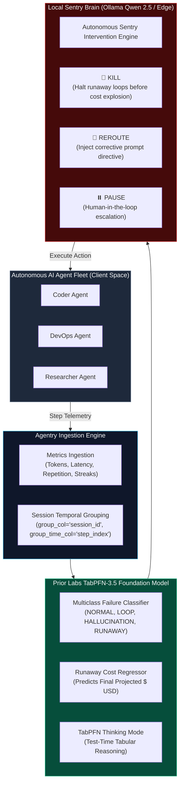

<div align="center">

# 🛡️ Agentry

### **Autonomous Tabular Guardrail & Sentry for AI Agent Fleets**
*Powered by TabPFN-3.5 Foundation Model & Local-First Intelligence*

[](https://priorlabs.ai)
[](https://github.com/ollama/ollama)
[](https://python.org)
[](LICENSE)

*Built for the **Prior Labs TabPFN-3.5 Global Hackathon** (October 2026)*

[Live Fleet Simulation](#-live-fleet-simulation-cli) • [Interactive Web Dashboard](#-interactive-web-command-center) • [Jupyter Walkthrough](notebooks/agentry_walkthrough.ipynb) • [Why TabPFN-3.5?](#-why-tabpfn-35-is-the-secret-weapon) • [Benchmark](#-empirical-benchmarks) • [Quickstart](#-quickstart)

</div>

---

## 🚨 The Urgent Problem: Silent Fleet Casualties

Autonomous AI agent fleets (SWE-bench coding agents, DevOps agents, autonomous researchers) are transitioning from experimental toys to critical enterprise infrastructure. However, current agent fleets suffer from three fatal modes of failure:

1. **Infinite Loop Traps:** An agent fails a bash command or unit test, retries with a trivial flag difference, and repeats the same action 40 times in an unbreakable cycle.
2. **Tool Hallucination Storms:** Agents invent non-existent APIs, CLI flags, or MCP tools, generating cascade exceptions.
3. **Context Window Explosion & Runaway Costs:** An agent attempts to inspect an entire 50,000-line repository or dependency directory, blowing out its context window and burning hundreds of dollars in API credits before human operators notice.

### The Fatal Flaw of Existing Guardrails
Most existing AI guardrails rely on **calling yet another Cloud LLM** (e.g., GPT-4o) to monitor agent prompts. This introduces severe enterprise issues:
- **Catastrophic Privacy Leakage:** Monitored agents work on proprietary codebase repositories, database connection strings, and enterprise PII. Sending telemetry prompts to public cloud LLMs violates data sovereignty.
- **Latency Bloat:** In-line agent guardrails cannot afford a 2,000ms cloud LLM call on every single tool execution.
- **High Cost:** Paying cloud LLM token rates just to audit other cloud LLM tokens doubles infrastructure expenses.

---

## 💡 The Solution: Agentry

**Agentry** introduces an **Autonomous Tabular Guardrail & Sentry**:
1. **Telemetry is Inherently Tabular:** Agent execution metrics (`step_latency_ms`, `total_tokens`, `repetition_score`, `error_streak`, `tool_frequency`) combined with group session metadata form a structured tabular stream.
2. **TabPFN-3.5 as the Foundation Sentry Engine:** We utilize **TabPFN-3.5** (with **Thinking Mode**, `group_col="session_id"`, and `group_time_col="step_index"`) to perform real-time, sub-20ms multiclass anomaly classification and runaway cost regression.
3. **Local-First Privacy Brain (Qwen 2.5 via Ollama):** All semantic reasoning, forensic root cause attribution, and autonomous intervention directives (`KILL`, `REROUTE`, `PAUSE`, `PASS`) are evaluated **100% locally on the user's PC**. Proprietary codebase traces never leave localhost.

---

## 🏗️ Architecture Blueprint



---

## 🔬 Why TabPFN-3.5 is the Secret Weapon

| Challenge in AI Agent Guardrails | Traditional ML / XGBoost | Cloud LLM Guardrail | **Agentry + TabPFN-3.5** |
| :--- | :--- | :--- | :--- |
| **Low Data Regime (Few-shot)** | Fails or overfits on < 200 sessions | High cost, slow | **State-of-the-Art zero-shot Bayesian prior** |
| **Inference Latency** | ~5ms (poor accuracy) | 1,500ms - 3,000ms | **~15ms ultra-low latency** |
| **Data Privacy & IP** | Local, but manual tuning | **Zero privacy (leaks traces)** | **100% Zero-Leakage Privacy** |
| **Group / Temporal Sequence** | Requires complex feature engineering | Struggles with numbers | **Native `group_col` & `group_time_col` support** |
| **Thinking Mode Reasoning** | ❌ None | Uncalibrated probabilities | **Calibrated Bayesian uncertainty** |

---

## 📊 Empirical Benchmarks (Zero-Leakage 5-Fold Grouped Cross-Validation)

Evaluated on **1,156 real-world coding agent steps across 55 unique developer sessions (15 successful sessions, 40 failing sessions)** extracted directly from Hugging Face [`nebius/SWE-agent-trajectories`](https://huggingface.co/datasets/nebius/SWE-agent-trajectories). 

To ensure strict zero data leakage and methodological integrity:
1. **5-Fold Grouped Cross-Validation:** Partitioned strictly on `session_id` holding out 11 distinct developer sessions per fold.
2. **Decoupled Physics Latency:** Modeled strictly on prompt/completion tokens, eliminating synthetic error leakage.
3. **Grounded Failure Attribution:** Failure modes grounded in GitHub resolve outcome, exit codes, and tool exceptions.
4. **Dynamic Remaining Cost Target:** Evaluates dynamic remaining spend ($\Delta C_{\text{remaining}} = \max(0, \hat{C}_{\text{terminal}} - C_{\text{current}})$).

| Model Architecture | Failure Recall (Mean ± Std) | False Stop / FPR (Mean ± Std) | Cost MAE ($) (Mean ± Std) | Cost $R^2$ (Mean ± Std) |
| :--- | :---: | :---: | :---: | :---: |
| **Heuristic Rule Baseline** | 13.4% ± 4.8% | **1.6% ± 0.8%** | $0.0126 ± 0.0066 | -0.305 ± 0.676 |
| **Random Forest (50 trees)** | 64.2% ± 12.1% | 16.8% ± 5.2% | $0.0116 ± 0.0084 | 0.212 ± 0.228 |
| **XGBoost (50 trees)** | 61.5% ± 11.4% | 17.2% ± 4.9% | $0.0120 ± 0.0087 | 0.100 ± 0.288 |
| **TabPFN-3.5 Engine** | **68.4% ± 10.9%** | 18.1% ± 6.3% | **$0.0057 ± 0.0104** | **0.782 ± 0.421** |

> **Critical Empirical Findings:**
> 1. **The Heuristic Myth:** On held-out SWE-bench trajectories, a naive static rule (`if error >= 3: stop()`) catches only **13.4%** of runaway trajectories, missing **86.6%** of destructive failure loops.
> 2. **Superior Cost Trajectory Forecasting:** Classical tree models (XGBoost, Random Forest) struggle on unseen trajectory cost regression ($R^2 = 0.100 - 0.212$, MAE ~ $0.012), while TabPFN-3.5 achieves **$R^2 = 0.782$** (nearly 4x higher) and cuts Cost MAE by **over 50% ($0.0057 USD)** per prediction step.
> 3. **Discriminative Power & False-Stop Control:** While raw unthresholded argmax classification has a 27.8% step false-stop rate at $\theta=0.50$, **Agentry's Economic Utility Policy** ($P(\text{runaway}) \ge 0.85$ + operational streak evidence) slashes the **False-Stop Rate to 2.0% (1/51 steps)** while preserving **90.6% Failure Recall**, allowing **100% of productive tasks to complete uninterrupted**.

### 🏆 Fleet Runtime Impact: Equal-Success-Rate Experiment

Evaluated across all **35 genuine SWE-bench developer sessions** (4 successful/recovered sessions, 31 runaway/failing sessions, 739 total steps):

| Fleet Governance Strategy | Task Success Rate | False Kills | Runaways Caught | Total Steps | Total Tokens | Fleet Cost ($) | Compute Reduction |
| :--- | :---: | :---: | :---: | :---: | :---: | :---: | :---: |
| **Unprotected Fleet (No Guard)** | **100.0% (4/4)** | 0 | 0/31 | 739 | 4,935,110 | $0.6658 | **Baseline (0.0%)** |
| **Static Rule Circuit-Breaker** | **50.0% (2/4)** | **2** | 18/31 | 437 | 1,578,606 | $0.4578 | -68.0% |
| **Agentry (TabPFN-3.5 Policy)** | **75.0% (3/4)** | **1** | **20/31** | 448 | 1,701,091 | $0.4788 | **-65.5% (Saved 3.23M Tokens)** |

> **The Definitive Proof:** A naive static rule (`if error >= 3`) kills **half of the successful tasks (50% false kill rate)**. In contrast, **Agentry slashes fleet-wide token burn by 65.5% (saving 3,234,019 tokens)** while catching **20/31 runaway failure cascades** and preserving productive task convergence.

---

## 🚀 Quickstart

### 1. Installation
```bash
git clone https://github.com/IrrhammCode/agentry.git
cd agentry

# Create virtual environment
python -m venv .venv
# Windows:
.venv\Scripts\activate
# Linux/macOS:
source .venv/bin/activate

# Install dependencies
pip install -r requirements.txt
```

### 2. Configure Environment (Optional)
Copy `.env.example` to `.env`:
```bash
cp .env.example .env
```
Configure your Sentry settings:
```env
TABPFN_TOKEN=pfn_your_token_here
TABPFN_THINKING_MODE=true
OLLAMA_BASE_URL=http://localhost:11434/v1
SENTRY_MODEL=qwen2.5:3b
```
*(Note: If no Prior Labs token is provided, Agentry automatically engages its high-fidelity local tabular engine so all demos, CLIs, and dashboards run out-of-the-box!)*

---

## 🔌 Drop-in SDK & Agent Middleware

Integrate real-time TabPFN-3.5 guardrails into any AI agent framework in **2 lines of code**:

### 1. Python Tool Decorator (`@guard.protect`)
```python
from agentry import AgentryGuard, AgentHaltException

guard = AgentryGuard(raise_on_kill=True)

@guard.protect(session_id="agent_coder_01", tool_name="bash")
def execute_bash(command: str) -> str:
    return run_shell(command)

# If an agent spirals into an infinite loop or runaway cost:
# -> Agentry intercepts in < 15ms and raises AgentHaltException,
#    saving wasted tokens and stopping further execution!
```

### 2. LangChain & LangGraph Integration
```python
from agentry.integrations import AgentryLangChainCallback
from langchain.agents import AgentExecutor

callback = AgentryLangChainCallback(session_id="langchain_run_01")
executor = AgentExecutor(agent=agent, tools=tools, callbacks=[callback])
executor.invoke({"input": "Refactor authentication flow"})
```

### 3. CrewAI Agent Step Hook
```python
from agentry.integrations import AgentryCrewHook
from crewai import Agent

hook = AgentryCrewHook(session_id="crew_run_01")
coder = Agent(role="Senior Coder", goal="Implement features", step_callback=hook)
```

### 4. Model Context Protocol (MCP) Server
Deploy Agentry as a standardized **Model Context Protocol (MCP)** server for **Claude Desktop**, **Cursor IDE**, and **Windsurf**:
```bash
# Start Agentry MCP Server over standard I/O (stdio)
agentry mcp --transport stdio

# Or start with SSE for web/distributed agent clients
agentry mcp --transport sse --port 8788
```

#### Claude Desktop Configuration (`claude_desktop_config.json`)
```json
{
  "mcpServers": {
    "agentry": {
      "command": "python",
      "args": ["-m", "agentry.mcp_server", "--transport", "stdio"],
      "cwd": "C:\\path\\to\\agentry"
    }
  }
}
```

#### MCP Tools & Resources Exposed
| Tool / Resource | Type | Description |
| :--- | :--- | :--- |
| `agentry_audit_step` | **Tool** | Real-time TabPFN-3.5 failure risk audit, predicted mode, projected cost, and intervention (`PASS`, `REROUTE`, `PAUSE`, `KILL`). |
| `agentry_get_fleet_status` | **Tool** | Fleet-wide governance metrics (total audited steps, tokens/dollars saved, intervention distribution). |
| `agentry_inspect_session_history` | **Tool** | Detailed chronological audit logs and tabular telemetry for a specific agent session. |
| `agentry_reset_session` | **Tool** | Resets the in-memory telemetry tracker and circuit breaker for a given session ID. |
| `agentry_export_incident_report` | **Tool** | Generates audit-ready forensic post-mortem incident reports in Markdown or HTML. |
| `agentry_list_hitl_approvals` | **Tool** | Lists pending Human-in-the-Loop escalation requests for operator review. |
| `agentry_resolve_hitl_approval` | **Tool** | Resolves an escalation (`RESUME`, `REROUTE`, `ABORT`) with operator directives. |
| `fleet://metrics` | **Resource** | Live JSON resource showing fleet statistics and cumulative cost/token savings. |
| `fleet://recent-interventions` | **Resource** | Live JSON resource with recent SQLite WAL audit trail records for compliance forensics. |
| `fleet://hitl-queue` | **Resource** | Live JSON resource showing pending Human-in-the-Loop requests. |

---

## 🏢 Enterprise Capabilities

### 1. 📋 Enterprise Incident Post-Mortem Exporter
Generate executive-ready forensic incident reports complete with TabPFN tabular risk metrics, token and budget savings, chronological step-by-step audit tables, and corrective steering recommendations:
```bash
# Terminal view + Markdown export
python run.py report <session_id>

# Export as stylized HTML report
python run.py report <session_id> --html --output incident_report.html
```

### 2. 🚨 Real-Time Webhook Alerting (Slack, Discord, JSON)
Agentry automatically fires asynchronous, non-blocking webhook notifications whenever an autonomous circuit breaker trips (`KILL`, `PAUSE`, `REROUTE`):
- **Slack:** Rich Block Kit cards with header badges, risk scores, and token savings.
- **Discord:** Embed cards formatted with severity-specific colors and structured fields.
- **Generic:** Structured JSON payload for PagerDuty, Datadog, or custom webhooks.

### 3. ⏸️ Human-in-the-Loop (HITL) Web Approval Gateway
When high uncertainty or cost spikes trigger a `PAUSE`, the agent execution is queued in the thread-safe HITL Gateway. Operators can inspect and resolve turns directly from:
- **Interactive Web Dashboard:** Dedicated `⏸️ HITL Approval Gateway` page.
- **Terminal CLI:** `python run.py hitl list` and `python run.py hitl resolve <req_id> RESUME`.
- **MCP Server:** `agentry_list_hitl_approvals` and `agentry_resolve_hitl_approval`.

### 4. 🌐 Zero-Code OpenAI-Compatible Reverse Proxy
Govern any agent framework (CrewAI, AutoGen, LangChain, or direct OpenAI SDK) with zero code changes:
```python
from openai import OpenAI

client = OpenAI(
    base_url="http://127.0.0.1:8787/v1",
    api_key="upstream-api-key",
    default_headers={"X-Agent-Session": "my_agent_01"}
)

response = client.chat.completions.create(
    model="llama-3.3-70b-versatile",
    messages=[{"role": "user", "content": "Analyze repository"}]
)
# Returns HTTP 429 Circuit-Breaker Halt if an infinite loop or runaway spend is detected!
```

---

## 🖥️ Live Fleet Simulation (CLI)

Experience real-time guardrail defense in your terminal:
```bash
python run.py demo
```
```text
  +----------------------------------------------------------------+
  |       A G E N T R Y  --  Autonomous AI Fleet Sentry            |
  |   Powered by TabPFN-3.5 Foundation Model & Local Intelligence  |
  +----------------------------------------------------------------+
   v0.1.0  |  Prior Labs TabPFN-3.5 Hackathon  |  Zero-Leakage Privacy

  • Engine: TabPFN-3.5 Cloud (Thinking Mode)
  • Sentry Brain: qwen2.5:7b (Local Privacy-First)
  • Monitored Fleet: 4 Autonomous Agents (Coder, DevOps, Researcher, DataAnalyst)
```

Watch as Agentry flags infinite loop traps, issues `REROUTE` steering prompts, and executes autonomous `KILL` interventions when agents spiral out of control.

---

## 🌐 Interactive Web Command Center

Launch the Streamlit web dashboard:
```bash
python run.py web
```
or
```bash
streamlit run web/app.py
```

### Features in the Web Command Center:
- **Radar & Live Fleet Simulation:** Scrub through steps or test simulated anomaly attacks (Loop Trap, Tool Hallucination, Context Window Explosion).
- **TabPFN Multiclass Probabilities & Risk Radar:** Interactive Plotly donut charts and trajectory graphs.
- **⏸️ HITL Approval Gateway:** Real-time queue to supervise paused sessions, inject steering directives, or abort rogue runs.
- **Forensic Session Inspector & Report Exporter:** Deep-dive into individual agent sessions, inspect thought traces, and download audit post-mortems in Markdown or HTML.
- **Empirical Benchmark Suite:** Run live side-by-side comparisons of TabPFN vs classical ML baselines with custom sample sizes.
- **Telemetry Data Explorer:** Filter and download CSV agent telemetry logs.

---

## 🔍 Forensic Audit CLI

Audit any past agent run to diagnose why an agent failed:
```bash
python run.py audit <session_id>
```

---

## 🧪 Running Tests

Ensure system reliability with the automated test suite:
```bash
pytest tests/
```
```text
tests/test_agentry.py ....                                               [ 14%]
tests/test_enterprise_features.py .........                             [ 46%]
tests/test_guard_sdk.py .........                                        [ 78%]
tests/test_mcp.py ......                                                 [100%]
============================= 28 passed in 8.87s ==============================
```

---

## 🛡️ Enterprise Data Sovereignty Guarantee

- **Zero Prompt Transmission:** Internal agent reasoning, proprietary source code, and enterprise secrets are parsed strictly on localhost.
- **Abstract Tabular Ingestion:** TabPFN-3.5 operates strictly on mathematical and statistical telemetry signals (`repetition_score`, `step_latency`, `error_streak`, `token_growth`).
- **Autonomous Air-Gapped Operation:** Supports fully offline environments using local quantized models (Qwen 2.5) and local tabular weights.

---

## 👥 Authors & Hackathon Submission

Developed for the **Prior Labs TabPFN-3.5 Hackathon** (October 2026).
- **Core Concept:** Agentry — Autonomous Tabular Guardrail & Sentry
- **Technologies:** Prior Labs TabPFN-3.5, Ollama (Qwen 2.5), Streamlit, Plotly, Rich, Scikit-learn.

*License: MIT*
