# 💡 Agentry: Innovation Ideas, Technical Explorations & Product Roadmap

> *"Cari Ide": Exploring Next-Generation Frontiers for TabPFN-3.5 in Autonomous Agent Fleet Governance*

---

## 🌟 Executive Summary: The Unique TabPFN Moat

Most agent guardrails today are built as "LLM-as-a-Judge" wrappers. They suffer from high latency (2,000ms), high token expenses, and privacy leaks.

**TabPFN-3.5 has a unique, unfair advantage:**
1. **Tabular Native:** Machine telemetry (step latency, token velocity, repetition score, error streak, tool diversity) is inherently tabular.
2. **Bayesian In-Context Prior:** It evaluates prior probability distributions rapidly without needing gradient descent or thousands of labeled samples.
3. **Calibrated Uncertainty:** TabPFN outputs true posterior probabilities and uncertainty bounds, allowing deterministic mathematical decision boundaries (e.g. `P(failure) > 0.85 AND Uncertainty < 0.15`).

Below are 8 high-impact ideas to expand Agentry into the definitive enterprise platform for autonomous agent safety.

---

## 🚀 Idea 1: Tabular Prompt Injection & Jailbreak Fingerprinting

### The Problem
Adversarial jailbreaks and prompt injection attacks are currently detected by sending the prompt to a secondary LLM (e.g. Llama Guard, NeMo Guardrails), which is slow (800ms) and can itself be jailbroken.

### The Innovation
Convert prompt text into a **16-dimensional tabular statistical fingerprint** and let TabPFN-3.5 classify adversarial intent in under 8 milliseconds:

| Feature Name | Type | Description |
| :--- | :--- | :--- |
| `char_entropy` | Float | Shannon entropy of raw character distribution (high in base64 / obfuscation) |
| `special_char_ratio` | Float | Percentage of non-alphanumeric punctuation and delimiters |
| `token_perplexity_var` | Float | Variance of log-probabilities across tokens |
| `semantic_negation_count`| Integer | Frequency of override terms (*"ignore previous"*, *"system prompt"*, *"DAN"*) |
| `prompt_token_length` | Integer | Absolute length of inbound prompt |
| `repetition_ngram_score` | Float | Compression ratio / repetitive token density |
| `unicode_anomaly_count` | Integer | Invisible zero-width spaces or homoglyph characters |

### Why TabPFN Wins Here:
TabPFN’s tabular foundation model can learn non-linear boundaries across these 16 statistical features with zero-shot generalization, catching novel jailbreaks without running language model inference.

---

## 🛡️ Idea 2: Kernel-Level eBPF Hardening & Syscall Interception

### The Problem
If an agent bypasses Python guardrails (e.g. through a subshell execution or binary exploitation), software-level hooks cannot halt the damage.

### The Innovation
Hook Agentry directly to **Linux eBPF (Extended Berkeley Packet Filter)** kernel probes:
1. When an agent attempts a tool execution, Agentry evaluates the TabPFN blast radius score.
2. If `score > 70`, Agentry dynamically injects a temporary eBPF filter at the kernel level (`sys_enter_unlinkat`, `sys_enter_rmdir`, `sys_enter_connect`).
3. If the process attempts to delete files outside the allowed project sandbox or ping unauthorized IPs, the **Linux kernel immediately returns `EPERM` (Operation Not Permitted)**.

---

## 🤖 Idea 3: Automated Multi-Turn Adversarial Red-Teaming Fuzzer

### The Problem
How do developers know their agent guardrails will hold up before deploying to production?

### The Innovation: "Agent vs. Sentry War Game"
Build a built-in adversarial fuzzer agent:
- The Fuzzer generates thousands of synthetic multi-turn edge cases (cyclic tool loops, malformed SQL queries, sneaky credential exfiltrations).
- Agentry monitors the fuzzer in real-time, logging tabular telemetry into `agentry_audit.db`.
- TabPFN uses this diverse telemetry as few-shot in-context examples, continuously sharpening its Bayesian priors.

---

## 📈 Idea 4: Predictive Token Futures & Cloud Compute Hedging

### The Problem
Runaway agent fleets can cause $10,000+ surprise cloud bills on OpenAI, Anthropic, or AWS Bedrock when loops occur during overnight batch runs.

### The Innovation
Combine **TabPFN Regression Mode** with dynamic compute arbitration:
1. At step $t=3$, TabPFN predicts the final session cost distribution ($E[Cost] = \$4.80 \pm \$1.20$).
2. If the projected cost exceeds the task's expected economic value, Agentry dynamically:
   - Downgrades the downstream model from GPT-4o to Llama-3.3-70B on Groq or Cerebras.
   - Restricts context window retention to the last 3 turns.
   - Automatically locks further API credit until approved.

---

## 🕸️ Idea 5: Swarm Mesh Quorum Attestation

### The Problem
In multi-agent architectures (CrewAI, AutoGen, LangGraph), one rogue agent can poison shared memory and cause the entire swarm to collapse into hallucination loops.

### The Innovation: Cryptographic Attestation Gate
- Every inter-agent message or tool result must be accompanied by an **Agentry Cryptographic Attestation Token**:
  $$\text{Sign}_{Agentry}(\text{session\_id}, \text{step}, \text{risk\_score}, \text{timestamp})$$
- Subordinate agents verify the token before accepting delegated tasks. If an agent's failure probability exceeds 0.65, its delegation privileges are revoked and quarantined.

---

## 🏢 Idea 6: High-Value Enterprise Vertical Blueprints

### 1. FinTech: Autonomous Trading & Portfolio Agents
- **Hazard:** Agent generates erroneous automated order loops or violates SEC market conduct rules.
- **Agentry Guard:** Tabular monitoring of order size, transaction velocity, and portfolio exposure variance with deterministic circuit breakers.

### 2. Healthcare & Biotech: HIPAA / PHI In-Flight Sanitizer
- **Hazard:** Diagnostic research agents inadvertently transmit patient medical records or genomic sequences to public LLMs.
- **Agentry Guard:** High-entropy Medical Record Number (MRN) and genomic sequence DLP redaction before network egress.

### 3. Enterprise Infrastructure & Cloud DevOps
- **Hazard:** SRE agents modifying Terraform scripts accidentally de-provision active production VPCs or drop master database clusters.
- **Agentry Guard:** Semantic blast radius sandbox freezing disk snapshots before destructive shell execution.

---

## 🎯 Idea 7: Winning Hackathon Presentation Strategy

### The 60-Second Hook
> *"Every autonomous AI agent fleet operating in production today is one bad bash command away from a $50,000 cloud bill or a wiped database. Traditional guardrails call slow, expensive cloud LLMs that require full prompt transmission. Agentry changes the paradigm: we use Prior Labs' TabPFN-3.5 foundation model to turn agent telemetry into a real-time Bayesian sentry that stops catastrophic failures before execution, operating on structured tabular signals with only short snippets needed for thinking mode."*

### Key Demo Moments:
1. **Show the Problem:** Agent attempts `rm -rf / --no-preserve-root` or an infinite retry loop.
2. **Show the TabPFN Secret:** Highlight that TabPFN evaluated 16 tabular telemetry dimensions in real time with Bayesian in-context precision.
3. **Show Autonomic Healing:** The agent doesn't just crash; Agentry rewinds disk files to snapshot $t=0$ and injects counterfactual steering.
4. **Show Live Enterprise Console:** The operator approves, steers, or aborts via the interactive Human-In-The-Loop war room.

---

## 🗺️ Product Roadmap

```mermaid
flowchart LR
    Phase1["Phase 1: Foundation (Current)"] --> Phase2["Phase 2: Swarm & Sandboxing"]
    Phase2 --> Phase3["Phase 3: Enterprise Mesh"]

    subgraph Phase1 ["Phase 1 (Completed)"]
        P1A["TabPFN-3.5 In-Context Engine"]
        P1B["Zero-Code OpenAI Proxy"]
        P1C["Real-Time Mission Control UI"]
        P1D["ACID SQLite Audit Storage"]
    end

    subgraph Phase2 ["Phase 2 (Q4 2026)"]
        P2A["eBPF Linux Kernel Probe"]
        P2B["Tabular Prompt Injection Fingerprinting"]
        P2C["Automated Red-Teaming Fuzzer"]
    end

    subgraph Phase3 ["Phase 3 (2027)"]
        P3A["Kubernetes Operator CRD"]
        P3B["Cross-Cloud Token Futures Governor"]
        P3C["Enterprise SSO & SAML Auditing"]
    end
```

